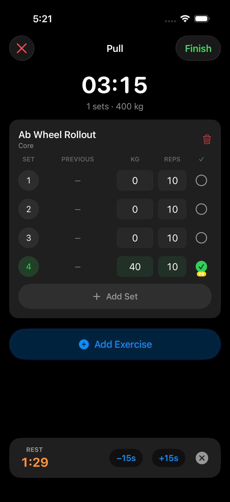
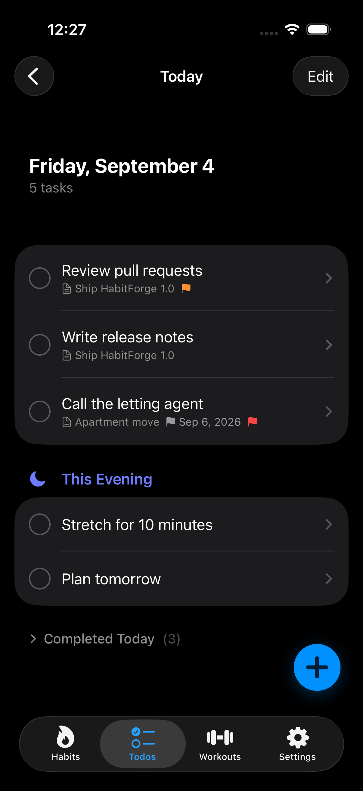
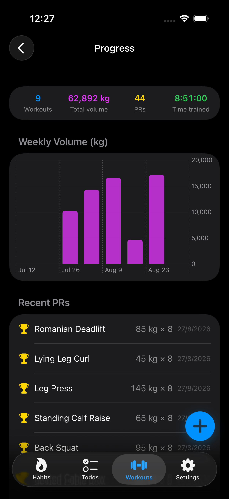
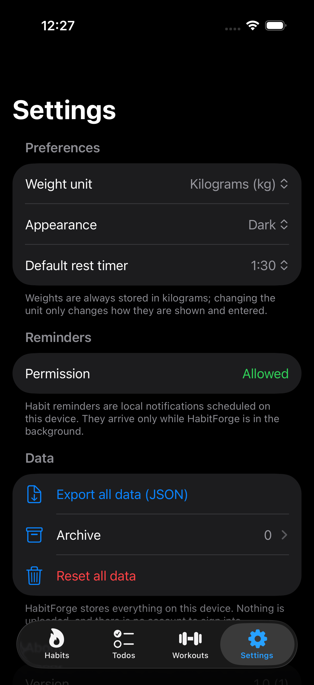

<p align="center">
  
</p>

<h1 align="center">HabitForge</h1>

<p align="center">
  <b>Habit tracker, GTD task manager and gym workout logger — one native iOS app.</b><br>
  Built entirely in SwiftUI + SwiftData. No accounts, no servers, no dependencies.
</p>

<p align="center">
  <a href="https://github.com/praveetgupta/HabitForge/actions/workflows/ci.yml"></a>
  
  
  
  
  
</p>

---

HabitForge collapses three apps into one. Instead of paying for **Streaks** *and* **Things 3**
*and* **Strong**, you get habit rings, a full GTD inbox and a set-by-set gym log behind a single
tab bar — sharing one local database, one design language and one launch.

Everything lives on your device. There is no sign-up, no cloud sync, no analytics, and no
third-party SDK of any kind — the entire app is Apple's own frameworks.

| Habits | Todos | Workouts | Active workout |
|---|---|---|---|
|  |  |  |  |

| Today | Workout progress | Settings |
|---|---|---|
|  |  |  |

## Features

### 🔥 Habits — streaks, rings and heatmaps

- **Build** habits (do the thing) and **Break** habits (avoid the thing)
- Three tracking modes: a simple tap-to-complete toggle, a **counter** (8 glasses of water),
  and a **duration** timer with a full-screen stopwatch
- Daily, *N* times per week, or *N* times per month, plus per-weekday scheduling
- Current and best streaks, recalculated on every change
- Month **calendar heatmap** and 7 / 14 / 30 / 90-day completion charts
- A combined all-habits progress graph with per-habit sparklines
- Per-day notes and mood, pause/resume, archive and restore
- Local notification reminders, scheduled per weekday

### ✅ Todos — a full GTD workflow

- The complete flow: **Inbox → Today → Upcoming → Anytime → Someday → Logbook**
- A two-date model that separates *when you plan to start* from a hard *deadline*
- **Areas → Projects → Headings → Todos → Checklists**, with project progress rings
- Repeating todos that spawn their next occurrence the moment you tick them off
- **Quick Add** with destination chips (Inbox / Today / Evening / Tomorrow / Next Week) and
  rapid multi-entry; a floating button reaches it from the Habits and Workouts tabs too
- Tags, priority flags, an evening section, swipe actions, drag-to-reorder and search
- Todos scheduled for a past date are promoted into Today automatically

### 🏋️ Workouts — routines, PRs and progressive overload

- **No fixed splits.** Build any routine you want: PPL, Upper/Lower, full body, a five-day
  bro split — a routine is a template, a session is one performance of it
- An **88-exercise seeded library** across 12 muscle groups, filterable by muscle and
  equipment, plus your own custom exercises
- Active workout screen with a live session clock and a `SET | PREVIOUS | KG | REPS | ✓` grid
- **Weights auto-fill from your last session**, per set index, so progressive overload is the
  default rather than a memory exercise
- Automatic **PR detection** with badges, running volume totals, and a per-set rest timer
  with ±15s and skip
- Post-session summary with mood, per-exercise weight and volume charts, session history
  grouped by month, and an 8-week volume trend

### ⚙️ Everywhere

- **kg / lb** — weights are stored in kilograms and converted only for display and entry
- Dark, light or system appearance
- **Export everything to JSON** — a documented, readable format, because local-only data
  deserves a way out
- Archive for retired habits and routines, with restore or permanent delete
- Accessibility labels throughout; VoiceOver can drive a whole workout

## Tech

| | |
|---|---|
| UI | SwiftUI, Swift Charts |
| Persistence | SwiftData — 14 `@Model` classes, local store |
| Architecture | MVVM with `@Observable` view models |
| Notifications | `UserNotifications`, local only |
| Minimum target | iOS 17 |
| Third-party dependencies | **None** |

Views own the `@Query` so SwiftData drives live updates, then push results into view models;
view models are `@Observable` classes built with a `ModelContext`. Enum-like fields are stored
as raw strings because SwiftData's `#Predicate` cannot filter cleanly on custom enums — the
canonical value lists live in [HANDOFF.md](HANDOFF.md), which is worth reading before you
change a model.

```
HabitForge/
├── App/            MainTabView — four tabs plus the global quick add
├── Models/         14 SwiftData @Model classes
├── ViewModels/     HabitViewModel, TodoViewModel, WorkoutViewModel
├── Views/          Habits/, Todos/, Workouts/, Settings/
├── Services/       AppSettings, DataExportService, NotificationService,
│                   ExerciseSeedData, DemoData (DEBUG only)
├── Components/     ProgressRingView, EmptyStateView
└── Extensions/     Color+Hex, Date+Helpers
```

## Building

Requires Xcode 16 or newer.

```bash
git clone https://github.com/praveetgupta/HabitForge.git
cd HabitForge
open HabitForge.xcodeproj    # then ⌘R
```

Or from the command line:

```bash
xcodebuild -project HabitForge.xcodeproj \
           -scheme HabitForge \
           -destination 'platform=iOS Simulator,name=iPhone 17 Pro' \
           build
```

Running on a physical device with a free Apple ID needs `-allowProvisioningUpdates`, and the
build stays valid for seven days — a limitation of free provisioning, not of the app.

## Testing

```bash
# Unit tests — habits, todos, workouts, weight conversion, export round-trip
xcodebuild test -project HabitForge.xcodeproj -scheme HabitForge \
                -destination 'platform=iOS Simulator,name=iPhone 17 Pro' \
                -only-testing:HabitForgeTests

# End-to-end workout flow, and the UI smoke suite
xcodebuild test -project HabitForge.xcodeproj -scheme HabitForge \
                -destination 'platform=iOS Simulator,name=iPhone 17 Pro' \
                -only-testing:HabitForgeUITests
```

## Regenerating the screenshots

The screenshots above are generated, not curated. `DemoData` seeds a fixed dataset when the
app is launched with `-HabitForgeDemoData` (DEBUG builds only), and a UI test walks the app
capturing each screen:

```bash
./Tools/screenshots.sh
```

The app icon is generated code too — edit the palette in `Tools/make_icon.swift` and re-run it
rather than hand-editing the PNG:

```bash
swift Tools/make_icon.swift HabitForge/Assets.xcassets/AppIcon.appiconset/AppIcon.png monogram
```

## Roadmap

- [ ] Home Screen and Lock Screen widgets
- [ ] Apple Watch companion for logging sets at the rack
- [ ] Rest-timer notifications while the app is backgrounded
- [ ] Reps-based PRs and estimated 1RM
- [ ] JSON import to match the existing export
- [ ] Optional iCloud sync (needs a paid developer account)
- [ ] App Store release

## Contributing

Issues and pull requests are welcome — see [CONTRIBUTING.md](CONTRIBUTING.md).
[HANDOFF.md](HANDOFF.md) documents the conventions and the gotchas that have already cost
someone hours; skimming it first will save you time.

## License

Licensed under the Apache License 2.0 — see [LICENSE](LICENSE).

---

<sub>Keywords: iOS habit tracker, SwiftUI habit tracker app, SwiftData example app, GTD task
manager iOS, Things 3 alternative open source, Strong app alternative, open source workout
tracker iOS, gym log app SwiftUI, streak tracker, progressive overload tracker, Swift Charts
example, MVVM SwiftUI architecture, offline-first iOS app, no-tracking productivity app.</sub>
