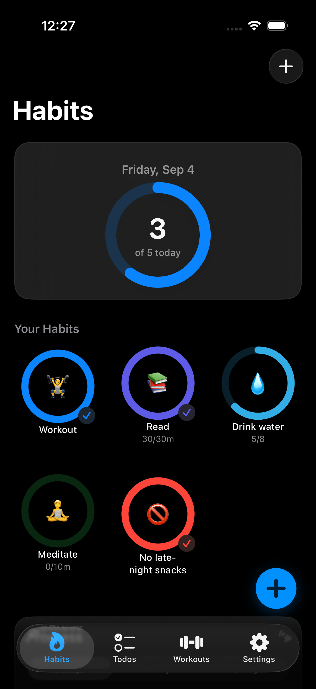
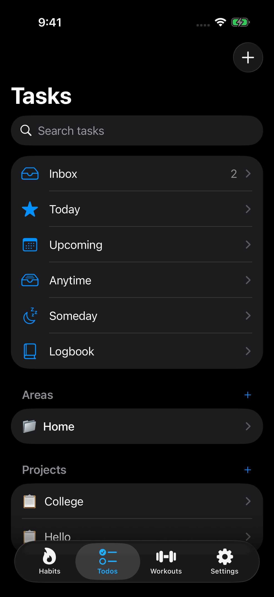
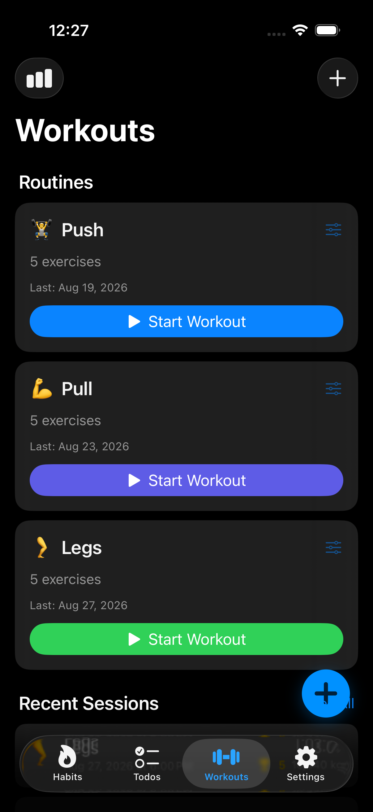

# HabitForge

**An all-in-one iOS productivity app combining habit tracking, task management, and workout logging.**

Built with SwiftUI, SwiftData, and MVVM architecture. Inspired by the best features of **Streaks**, **Things 3**, and **Strong Pro** — unified into a single, elegant app.

---

## Features

### 🔥 Habit Tracking (Streaks-Inspired)
- **Build & Break habits** — track habits you want to build or break
- **Three tracking modes** — simple toggle, count-based (e.g., 8 glasses of water), and duration-based with built-in timer
- **Flexible scheduling** — daily, specific days of the week, or X times per week/month
- **Circular progress rings** — color-coded rings that fill as you complete habits
- **Streak tracking** — current streak, best streak, completion rate, total completions
- **Calendar heatmap** — month view with colored cells showing your consistency
- **Progress charts** — Swift Charts integration with 7/14/30-day views
- **Overall progress graph** — combined daily completion across all habits
- **Notes & mood tracking** — daily notes and mood tags on any habit entry
- **Pause & resume** — temporarily pause habits without breaking streaks
- **Smart reminders** — local notifications on scheduled days

### ✅ Task Management (Things 3-Inspired)
- **GTD workflow** — Inbox → Today → Upcoming → Anytime → Someday → Logbook
- **Two-date system** — "When" date (when to start) vs "Deadline" (when it's due)
- **Areas & Projects** — organize tasks into areas of responsibility and projects with progress tracking
- **Project headings** — section dividers within projects for structured task groups
- **Checklists** — sub-tasks within any todo with drag-to-reorder
- **Quick Add (Magic Plus)** — capture tasks instantly from anywhere with destination chips
- **Evening section** — separate evening tasks in the Today view
- **Repeating tasks** — daily, weekly, monthly, yearly recurrence with auto-creation
- **Tags & priorities** — cross-cutting categorization with color-coded priority flags
- **Smart scheduling** — auto-promote upcoming tasks to Today when their date arrives
- **Swipe actions** — swipe to complete, schedule, or move tasks between lists
- **Search** — full-text search across titles, notes, and tags

### 🏋️ Workout Logging (Strong Pro-Inspired)
- **Custom routines** — create any workout split (PPL, Upper/Lower, Full Body, Bro Split, etc.)
- **Exercise library** — 70+ pre-loaded exercises organized by muscle group and equipment
- **Custom exercises** — add your own exercises with muscle group and equipment tags
- **Live session logging** — log sets with weight × reps in real-time
- **Set types** — warmup, working, drop set, to failure
- **Rest timer** — auto-start between sets with customizable duration
- **Auto PR detection** — personal records flagged automatically with badges
- **Volume tracking** — total weight × reps calculated per session
- **Progress charts** — per-exercise weight and volume graphs over time
- **Workout history** — calendar view of past sessions with full details
- **Post-workout summary** — duration, volume, PRs, and mood rating

### ⚙️ Infrastructure
- **Firebase Authentication** — email + Sign in with Apple
- **Local notifications** — habit reminders and todo due dates
- **RevenueCat subscriptions** — free tier and Pro monthly/yearly plans
- **SwiftData persistence** — Apple's modern local database
- **Cloud sync ready** — CloudKit integration for cross-device sync

---

## Tech Stack

| Technology | Purpose |
|-----------|---------|
| **SwiftUI** | Declarative UI framework |
| **SwiftData** | Local persistence (Apple's modern Core Data replacement) |
| **MVVM** | Architecture pattern |
| **Swift Charts** | Native charting for progress graphs |
| **Firebase Auth** | User authentication |
| **RevenueCat** | In-app subscription management |
| **UserNotifications** | Local push notifications |

---

## Architecture

```
HabitForge/
├── App/                    # App entry point, tab bar
├── Models/                 # SwiftData @Model classes (14 models)
├── ViewModels/             # @Observable MVVM view models
├── Views/
│   ├── Auth/               # Login, signup, onboarding
│   ├── Habits/             # Dashboard, rings, detail, charts, timer
│   ├── Todos/              # Inbox, Today, Upcoming, detail, projects
│   ├── Workouts/           # Routines, active session, progress
│   └── Settings/           # Profile, subscription, preferences
├── Services/               # Auth, notifications, subscriptions
├── Components/             # Reusable UI (progress ring, empty states)
└── Extensions/             # Color+Hex, Date+Helpers
```

### Data Models
- **Habits**: `Habit`, `HabitEntry`
- **Todos**: `Todo`, `ChecklistItem`, `Area`, `Project`, `ProjectHeading`, `Tag`
- **Workouts**: `Routine`, `Exercise`, `RoutineExercise`, `WorkoutSession`, `PerformedExercise`, `PerformedSet`

---

## Screenshots

<!-- Add screenshots here -->
| Habits | Todos | Workouts |
|--------|-------|----------|
|  |  |  |

---

## Getting Started

### Prerequisites
- macOS with Xcode 15+
- iOS 17.0+ deployment target
- Apple Developer account (free for development, $99/year for App Store)

### Setup
1. Clone the repository
   ```bash
   git clone https://github.com/yourusername/HabitForge.git
   cd HabitForge
   ```

2. Open in Xcode
   ```bash
   open HabitForge.xcodeproj
   ```

3. Add Firebase configuration
   - Create a project at [Firebase Console](https://console.firebase.google.com)
   - Download `GoogleService-Info.plist` and add to the project root

4. Build and run
   - Select your target device/simulator
   - Press `⌘R`

---

## Subscription Tiers

### Free
- 3 habits
- Basic todos (Inbox, Today, Logbook)
- 3 workout routines
- 30-day history

### Pro ($4.99/mo or $39.99/yr)
- Unlimited habits, todos, and routines
- Custom exercises
- Full history and advanced charts
- Cloud sync across devices
- Priority support

---

## Roadmap

- [x] Habit tracking with streaks and charts
- [x] Things 3-style task management
- [ ] Workout logging with progress tracking
- [ ] Firebase authentication
- [ ] RevenueCat subscription paywall
- [ ] Onboarding flow
- [ ] Widget support (iOS home screen)
- [ ] Apple Watch companion
- [ ] Data export (CSV)
- [ ] Shortcuts/Siri integration

---

## License

This project is proprietary. All rights reserved.

---

## Author

**Praveet Gupta**

Built with SwiftUI and an unhealthy amount of caffeine ☕
